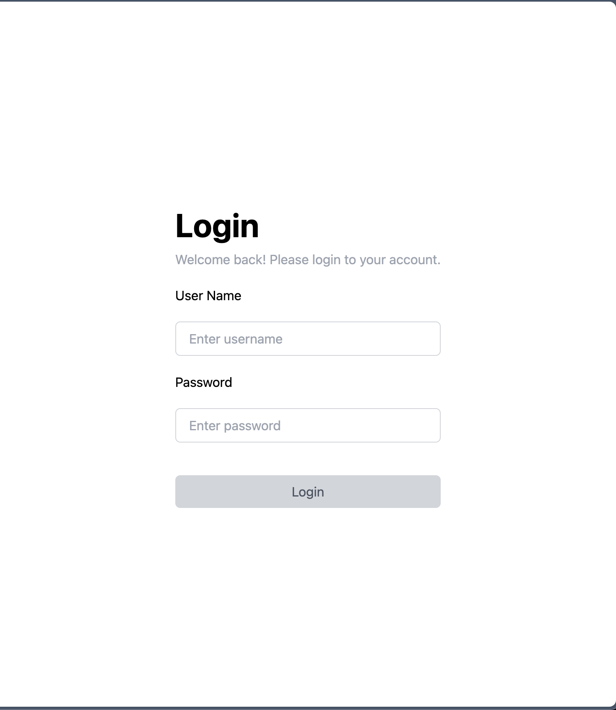
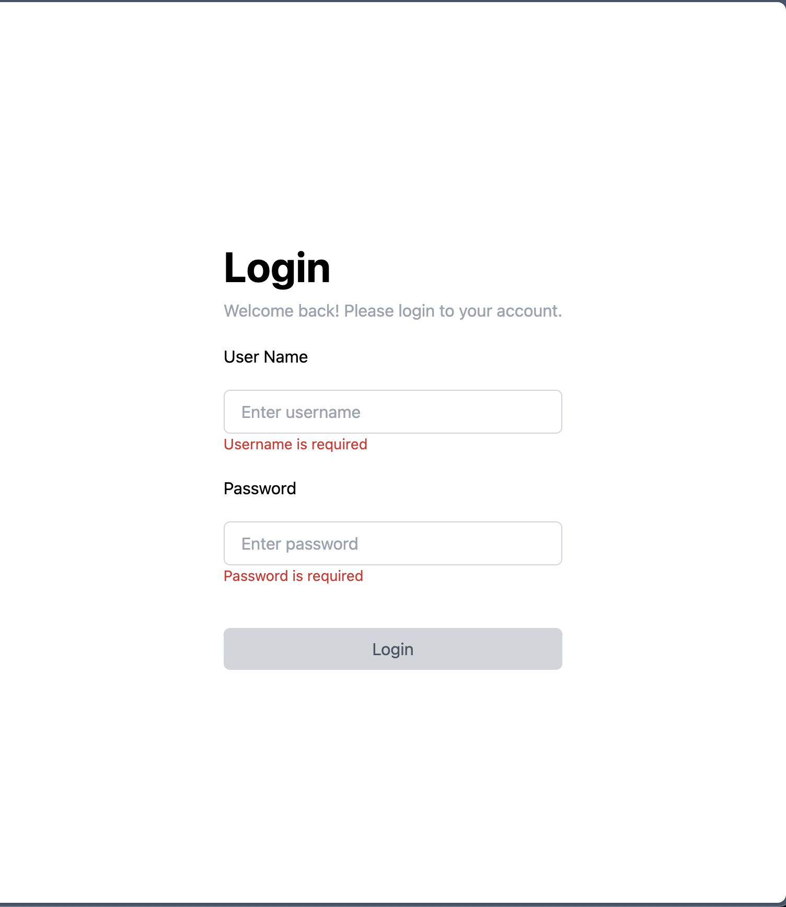
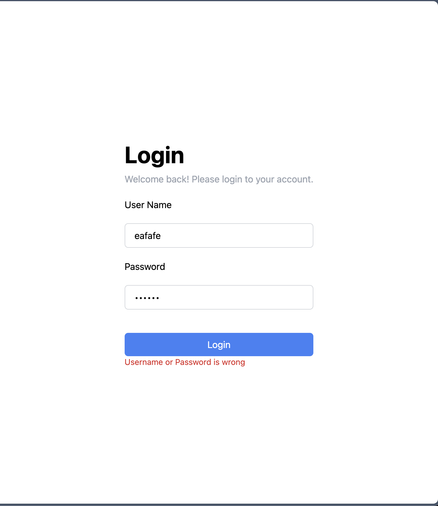
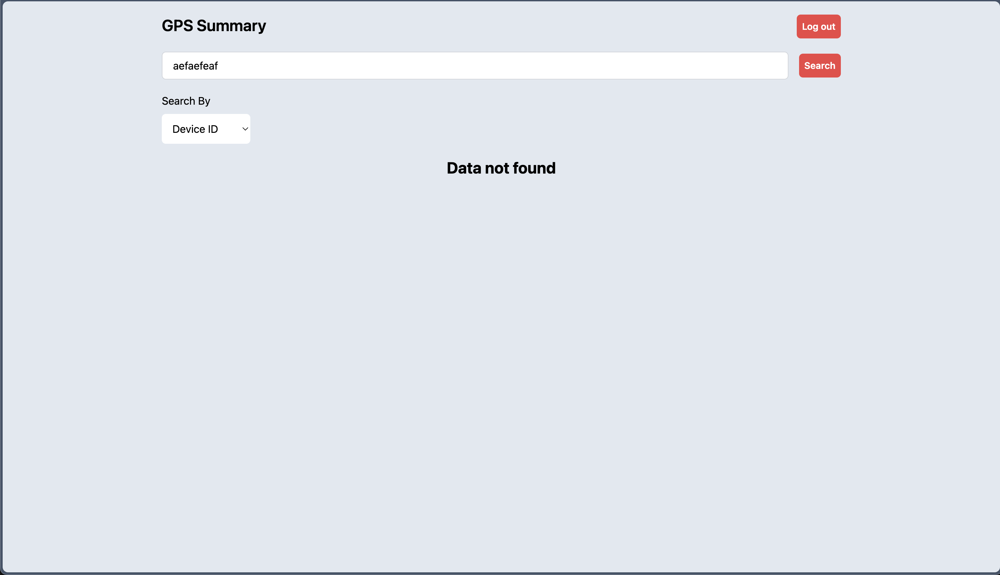
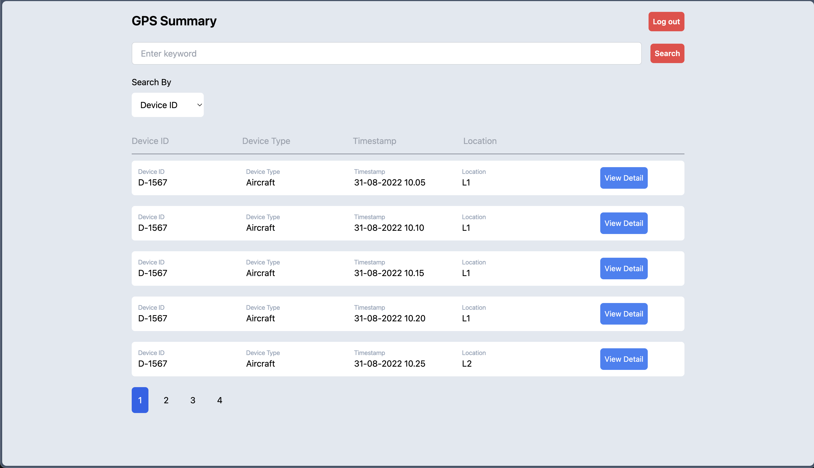
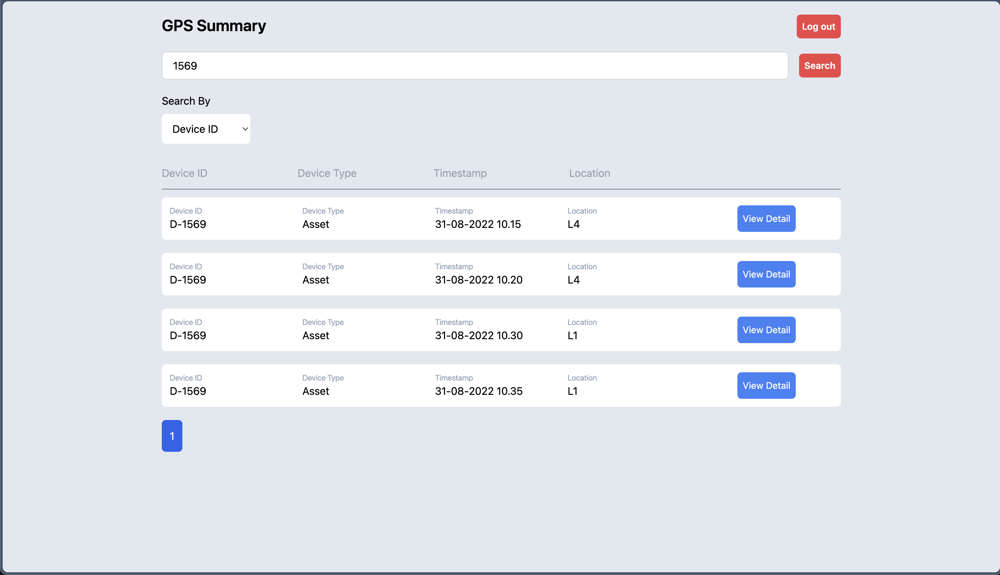
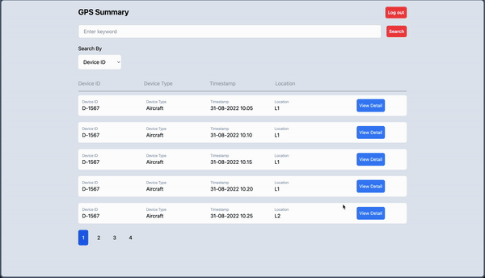

# Gpsproject

This project was generated with [Angular CLI](https://github.com/angular/angular-cli) version 18.0.2 with TypeScript.

## Development server

Run `ng serve` for a dev server. Navigate to `http://localhost:4200/`. The application will automatically reload if you change any of the source files. please install node modules `npm i` or `npm install`, please do `sudo ng serve` and `sudo npm install` if the build or package installation is failed.

## Username and Password
This app use static username and password  

`Username: moovd_test`  
`Password: moovd_password`

## Libraries/Modules Used
This application use native angular packages for form validation, common modules, reactive modules. with 3rd libraries such as Tailwind and Chart.js(ng2-charts).

## Technical Solution
### Constraints
- I have included some unit testing cases in some components, in the gps-detail component still have an error because I have not figured out the way to pass a query params in unit testing as the view need query params to show the gps detail data.
- Difficulties when adding some new configuration to show Chart.JS
- Passing method as props is a bit confusion compared to some other framework.
- Difficulties on conditional rendering, some native modules need to be imported like `CommonModules` to be able to provide conditional syntax in the view.

### Architecture
- Component-based architecture (atomic-like design pattern) is used in this project, a custom providers is configured to provide Chart.JS rendering, you can check it in the `main.ts` file

### Possible enhancements
- Adding animations/interactions would give more engaging User Experiences on the application usage
- Add lazy load or skeleton when fetching from API, because in this test dummy data is being used, no need to add lazy load or skeleton

## Test Case
1. Disabled Login Button when username and password aren't inputted yet

2. When user is typing and deleting the username/password field, the warning shown as follow

3. Show invalid username/password text and prevent user to redirect to gps-summary page

4. When search data aren't found, show `Data not found` message

5. Able to sort by Location
### Asc

### Desc

6. Able to search by Device ID/Device Type
## Device Type

## Device ID

7. Redirect to detail page from Gps Card to Gps Detail

